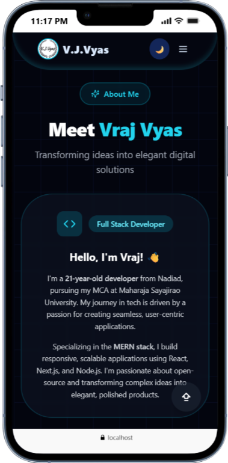

# 🚀 Vraj Vyas Portfolio: Where Code Meets Creativity!

Hey there! 👋 I'm **Vraj Vyas**, a passionate Full Stack Developer turning wild ideas into sleek, high-performance web experiences. Dive into my digital playground – a showcase of innovative projects, sharp skills, and a dash of futuristic flair. Ready to geek out? Let's scroll! 

[](https://vrajvyasportfolio.vercel.app)

---

## 🌟 About Me: The Developer Behind the Magic

Built with **React** and **Tailwind CSS**, this portfolio isn't just a site – it's a living, breathing canvas! Picture this: a **sleek, modern design** that flips between light and dark modes like a pro DJ switching tracks, **butter-smooth animations** that pop on scroll, and **fully responsive layouts** that dance perfectly on your phone, tablet, or massive monitor.

As a frontend wizard with backend superpowers, I craft **responsive, user-centric apps** that don't just work – they *wow*. From pixel-perfect UIs to robust APIs, I blend creativity with code to solve real-world puzzles. Currently chasing my MCA dreams while building the next big thing! 💡

> *"Code is like humor. When you have to explain it, it’s bad."* – Cory House  
> *(But mine? It's hilariously efficient. 😎)*

---

## ⚡ Epic Features That'll Blow Your Mind

- 🌙 **Dark Mode Magic**: Toggle themes with silky transitions – no jarring flashes here!
- ⌨️ **Hero Typing Effect**: Watch my role as "Full Stack Developer" type itself out in real-time. Dynamic? You bet!
- 📱 **Mobile-First Mastery**: Scales flawlessly from tiny screens to epic desktops. Test it – you'll be hooked.
- 🎯 **Interactive Showdowns**: Hover over skills or projects for micro-animations that feel alive. No more static snoozefest!
- ✉️ **Smart Contact Form**: Validates inputs, sends vibes straight to my inbox, plus social links that link up seamlessly.
- ⏳ **Timeline Tango**: Education and experience laid out in a clean, interactive timeline – scroll through my journey like a storybook.
- 🧭 **Smooth Scrolling Saga**: Navigation that glides like butter, with active section highlights for that pro feel.
- 🔄 **Live Project Pulse**: Fetches fresh GitHub data on the fly – see my latest repos sparkle with stars, forks, and updates!

*Pro Tip: Hit F12 and watch the console for Easter eggs. Shh... don't tell! 🐣*

---

## 🛠️ Tech Stack: The Power Tools in My Arsenal

| Category | Tech | Why I ❤️ It |
|----------|------|-------------|
| **Frontend** | **React** | The king of components – reusable, reactive, and ridiculously fun! |
| **Styling** | **Tailwind CSS** | Utility-first sorcery: Style in seconds, no CSS headaches. |
| **Build** | **Vite** | Lightning-fast dev server. Who has time for slow builds? |
| **Icons** | **Lucide Icons** | Crisp, customizable icons that fit any vibe. |
| **Language** | **JavaScript (ES6+)** | The Swiss Army knife of the web – versatile and ever-evolving. |
| **State Mgmt** | **React Hooks** | Clean, functional state without the class drama. |
| **Animations** | **Intersection Observer API** | Scroll-triggered magic that keeps users scrolling (in a good way!). |

*Bonus: Integrated with GitHub API for real-time project vibes – because stale data is so 2024. 🚀*

---

## 📸 Screenshots: A Visual Feast (Desktop Edition)

Feast your eyes on these high-res captures! From hero vibes to project galleries, it's all here. (Mobile shots? Just as fire – check the live demo!)

### Quick Thumbnail Tease


### Deep Dive Gallery
| **Home Section**<br>Where the adventure begins! 🌌 | **About Section**<br>My story, unfiltered. 📖 | **Skills Section**<br>Tech toolkit on blast! 🔧 |
|-----------------------------------|-----------------------------------------|-----------------------------------------|
|  |  |  |

| **Education Section**<br>From classrooms to code labs. 🎓 | **Work Section**<br>Real-world triumphs! 🏆 | **Contact Section**<br>Let's chat – ideas await! 💬 |
|-------------------------------------------|-----------------------------------|-----------------------------------------|
|  |  |  |

| **Project Gallery**<br>Live GitHub magic in action! ⭐ |
|-----------------------------------------------|
|  |


---

## 🏃‍♂️ Quick Start: Fire It Up Locally!

Getting this bad boy running? Easier than brewing coffee. ☕

1. **Clone the Repo** (grab the goods!):
   ```bash
   git clone https://github.com/VrajVyas11/VrajVyas_Portfolio.git
   cd VrajVyas_Portfolio
   ```

2. **Install the Dependencies** (npm, assemble!):
   ```bash
   npm install
   ```

3. **Launch the Dev Server** (let the magic unfold):
   ```bash
   npm run dev
   ```

4. **Open the Portal** (browser time!):
   Head to [http://localhost:5173](http://localhost:5173) and watch it sparkle. 🌟

*Trouble? Ping me – I'm all ears (and code).*

---

## 📜 License: Freedom to Fork!

This project's under the super-friendly **MIT License**. Fork, tweak, deploy – just give a shoutout if it sparks joy! 🎉


---

## 🤝 Let's Connect: Join the Vibe Tribe!

- 🚀 [GitHub](https://github.com/VrajVyas11) – Where the code lives and breathes.
- 💼 [LinkedIn](https://linkedin.com/in/vraj-vyas-983249297) – Professional vibes and collabs.
- 🌐 [Live Portfolio](https://vrajvyasportfolio.vercel.app) – The full immersive experience.

Drop a star on the repo if this inspired you? ⭐ Your support fuels the fire!

---

## 🎊 Thanks for Stopping By!

Thanks for exploring my corner of the web! If this portfolio lit a spark, imagine what we could build together. Hit me up – let's create something legendary. 🚀✨

**Vraj Vyas**  
